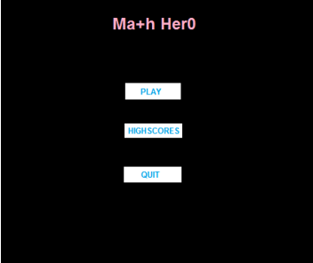

# Math Hero

Math Hero is a game created using the OpenGL library, where players solve simple random equations to achieve the highest score within a set time limit.

## Specifications

### Main Menu

1. The game starts with a menu displaying the title "Math Hero" and three buttons: PLAY, HIGHSCORES, and QUIT.
   
   
   

2. The user selects a button by clicking on it with the left mouse button.

### Gameplay

3. If the PLAY button is selected from the menu, the Math Hero game starts:
   - The game presents a continuous stream of simple random equations (addition, subtraction, and multiplication) moving from the bottom of the game window to the top, similar to movie credits. The user's objective is to solve as many equations as possible within 60 seconds. The current score is displayed in the top left corner of the window.

      

   - The user inputs an answer by typing a number on the keyboard and pressing the Enter key. If the answer is correct, the score increments by one; if incorrect, no change occurs.
   - After 60 seconds, the game stops automatically, and a window appears displaying the user's final score and rank.

      **Figure 3 - Score Page**
      

   - The user can press the F1 key to restart the game or the F2 key to return to the main menu.

### High Scores

4. If the HIGHSCORES button is selected from the menu, the top 5 scores are shown.

   **Figure 4 - Highscores Window**
   

### Quitting the Game

5. If the QUIT button is selected from the menu, the game closes.

